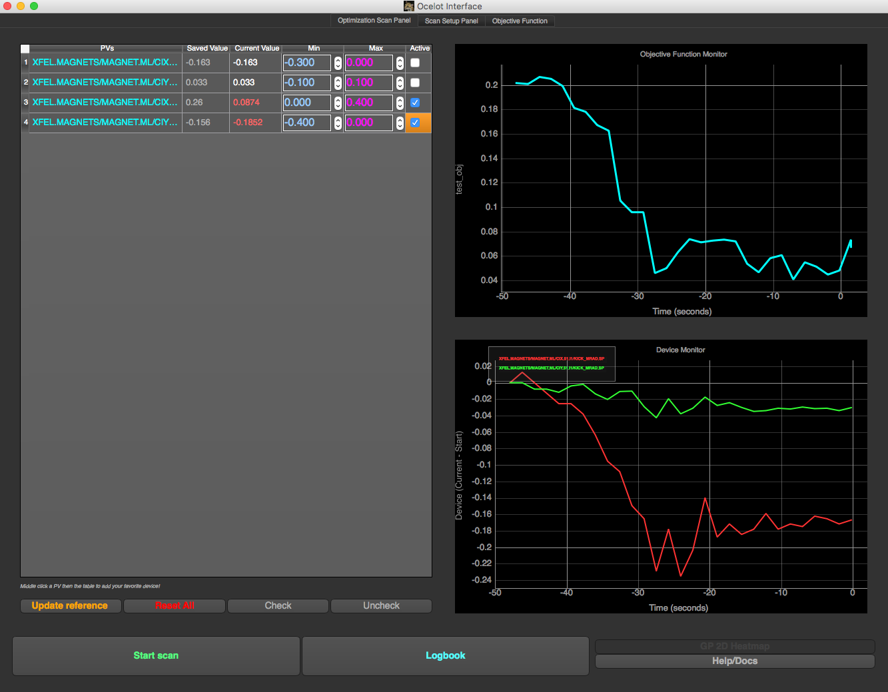

.. OcelotInterface documentation master file, created by
   sphinx-quickstart on Wed May 11 14:19:02 2016.
   You can adapt this file completely to your liking, but it should at least
   contain the root `toctree` directive.

Welcome to OcelotInterface's documentation
==========================================

**This page documents the structure and various packages used in the OcelotInterface GUI.**

*The OcelotInterface GUI after a simplex optimization of the beam pointing at the end of the Injector*

Contents
--------
.. toctree::
        :maxdepth: 2

        intro
        usage 
        structure
        status
	

Source Documentation
------
.. toctree::
        :maxdepth 3

        modules

Indices and tables
------------------

* :ref:`genindex`
* :ref:`modindex`
* :ref:`search`

